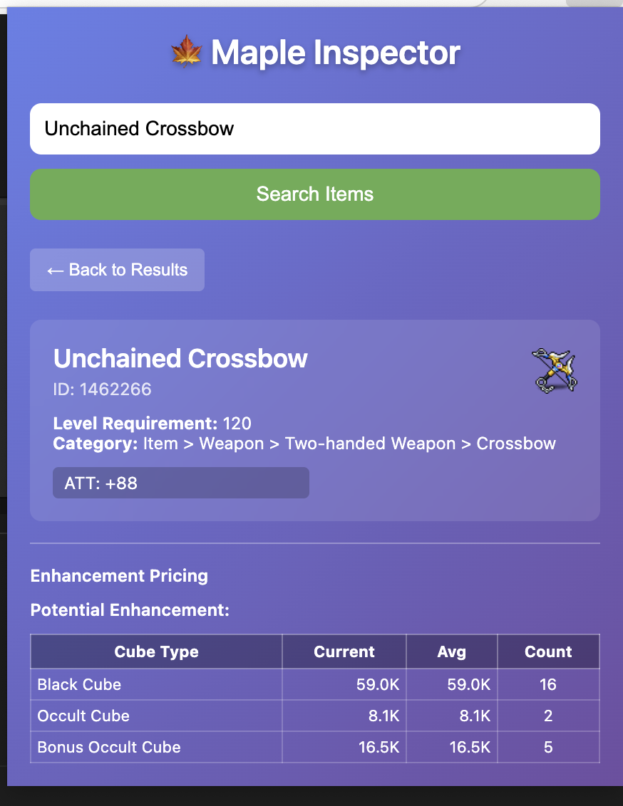

# 🍁 Maple Inspector

A Chrome extension for MapleStory item search and pricing using the MSU Navigator API. Search for items by selecting text on any webpage and get detailed item information including enhancement pricing.

## Features

- **Context Menu Search**: Right-click on selected text to search for MapleStory items
- **Item Metadata**: Get detailed information including stats, requirements, and categories
- **Enhancement Pricing**: View current and historical pricing for:
  - Starforce enhancements (0-22 stars)
  - Potential enhancements (Black Cube, Occult Cube, Bonus Occult Cube)
- **Modern UI**: Beautiful gradient interface with responsive design
- **Smart Caching**: Recent search results are cached for quick access

## Screenshots


*Search results showing MapleStory items with detailed information*


*Enhancement pricing view with Starforce and Potential options*


## Installation

### From Source (Development)

1. Clone or download this repository
2. Open Chrome and navigate to `chrome://extensions/`
3. Enable "Developer mode" in the top right
4. Click "Load unpacked" and select the extension directory
5. The Maple Inspector extension should now appear in your extensions

### Usage

#### Method 1: Context Menu Search
1. Select any text on a webpage (e.g., "Silver Blossom Ring")
2. Right-click and select "Search MapleStory Item: [selected text]"
3. The extension popup will open with search results

#### Method 2: Manual Search
1. Click the Maple Inspector icon in your browser toolbar
2. Type an item name in the search box
3. Click "Search Items" or press Enter
4. Click on any item to view detailed information

#### Viewing Enhancement Pricing
1. After selecting an item, scroll to the "Enhancement Pricing" section
2. For Starforce: Click any star level button (0★ to 22★)
3. For Potential: Click cube type buttons (Black Cube, Occult Cube, etc.)
4. View current pricing and historical maximums

## API Integration

This extension integrates with the MSU Navigator API:

- **Search Endpoint**: `https://msu.io/navigator/api/navigator/search`
- **Metadata Endpoint**: `https://msu.io/navigator/api/navigator/metadata/items/{id}/info`
- **Pricing Endpoint**: `https://msu.io/navigator/api/navigator/msu-stats/dynamic-pricing/enhance-price/history`

## File Structure

```
maple-inspector/
├── manifest.json          # Extension manifest (Manifest V3)
├── background.js          # Service worker for API calls
├── content.js            # Content script for text selection
├── popup.html            # Extension popup interface
├── popup.js              # Popup functionality
├── icons/                # Extension icons
└── README.md             # This file
```

## Technical Details

- **Manifest Version**: 3 (latest Chrome extension standard)
- **Permissions**: 
  - `contextMenus` - For right-click search functionality
  - `activeTab` - For content script injection
  - `storage` - For caching search results
- **Host Permissions**: `https://msu.io/*` - For API access
- **APIs Used**: Chrome Extensions API, Fetch API, Chrome Storage API

## Development

### Key Components

1. **Background Script** (`background.js`)
   - Handles context menu creation and clicks
   - Makes API calls to MSU Navigator
   - Manages data flow between components

2. **Content Script** (`content.js`)
   - Monitors text selection on web pages
   - Minimal footprint, non-intrusive

3. **Popup Interface** (`popup.html`, `popup.js`)
   - Modern gradient UI design
   - Search functionality and results display
   - Item details and pricing information
   - Responsive design for various content sizes

### API Response Handling

The extension handles various API responses:
- Search results with item lists
- Detailed item metadata including stats and requirements
- Enhancement pricing with historical data
- Error handling for failed requests

### Pricing Data

Enhancement pricing includes:
- **Current Pricing**: Latest available pricing data
- **Historical Maximums**: Peak pricing over time
- **Enhancement Counts**: Number of enhancement attempts
- **Price Formatting**: Automatic K/M formatting for large numbers

## Contributing

1. Fork the repository
2. Create a feature branch
3. Make your changes
4. Test the extension thoroughly
5. Submit a pull request

## License

This project is open source. Please respect the MSU Navigator API terms of service.

## Disclaimer

This extension is not affiliated with Nexon or MapleStory. It uses publicly available APIs for educational and utility purposes.
