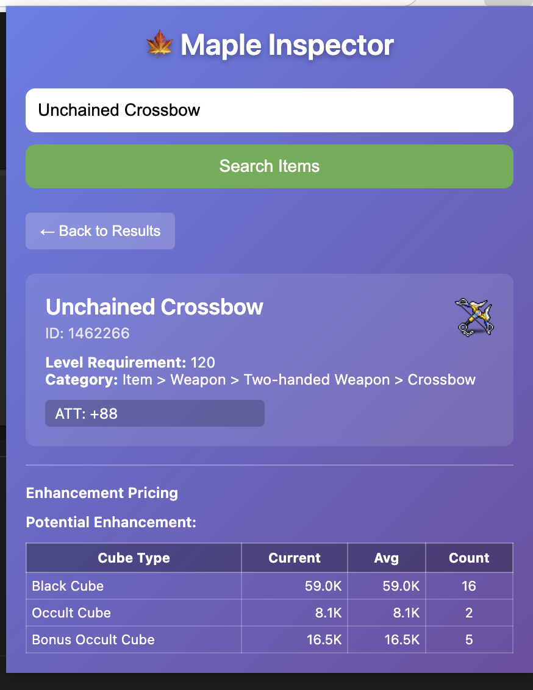

# 🍁 枫叶价格检查器

一个用于冒险岛物品搜索和价格查询的Chrome浏览器扩展，使用MSU Navigator API。通过选择网页上的文本来搜索物品，获取详细的物品信息包括强化价格。

## 功能特性

- **右键菜单搜索**：右键点击选中的文本即可搜索冒险岛物品（仅限msu.io网站）
- **物品详细信息**：获取包括属性、需求和分类在内的详细信息
- **强化价格查询**：查看当前和历史价格：
  - 星力强化（0-22星）
  - 潜能强化（黑方、白方、高级白方）
- **现代化界面**：美观的渐变界面和响应式设计
- **智能缓存**：最近的搜索结果会被缓存以便快速访问
- **域名限制**：仅在msu.io上工作，专注功能性

## 截图


*搜索结果显示冒险岛物品的详细信息*


*强化价格视图，包含星力和潜能选项*

## 安装方法

### 从源码安装（开发版）

1. 克隆或下载此仓库
2. 打开Chrome浏览器，导航到 `chrome://extensions/`
3. 在右上角启用"开发者模式"
4. 点击"加载已解压的扩展程序"并选择扩展目录
5. Maple Inspector扩展应该会出现在您的扩展列表中

### 使用方法

#### 方法1：右键菜单搜索（仅限msu.io）
1. 导航到msu.io上的任意页面
2. 选择页面上的任意文本（例如："Silver Blossom Ring"）
3. 右键点击并选择"搜索冒险岛物品：[选中的文本]"
4. 扩展弹窗将打开并显示搜索结果

#### 方法2：手动搜索
1. 点击浏览器工具栏中的Maple Inspector图标
2. 在搜索框中输入物品名称
3. 点击"搜索物品"或按回车键
4. 点击任意物品以查看详细信息

#### 查看强化价格
1. 选择物品后，滚动到"强化价格"部分
2. 星力强化：点击任意星级按钮（0★ 到 22★）
3. 潜能强化：点击方块类型按钮（黑方、白方等）
4. 查看当前价格和历史最高价

## API集成

此扩展集成了MSU Navigator API：

- **搜索接口**：`https://msu.io/navigator/api/navigator/search`
- **元数据接口**：`https://msu.io/navigator/api/navigator/metadata/items/{id}/info`
- **价格接口**：`https://msu.io/navigator/api/navigator/msu-stats/dynamic-pricing/enhance-price/history`

## 文件结构

```
maple-inspector/
├── manifest.json          # 扩展清单文件（Manifest V3）
├── background.js          # 用于API调用的服务工作者
├── content.js            # 用于文本选择的内容脚本
├── popup.html            # 扩展弹窗界面
├── popup.js              # 弹窗功能
├── icons/                # 扩展图标
├── README.md             # 英文说明文件
└── README_CN.md          # 中文说明文件（本文件）
```

## 技术细节

- **清单版本**：3（最新的Chrome扩展标准）
- **权限**：
  - `contextMenus` - 用于右键搜索功能（仅限msu.io）
  - `storage` - 用于缓存搜索结果
- **主机权限**：`https://msu.io/*` - 用于API访问和内容脚本注入
- **使用的API**：Chrome扩展API、Fetch API、Chrome存储API

## 开发

### 核心组件

1. **后台脚本**（`background.js`）
   - 处理右键菜单的创建和点击
   - 向MSU Navigator发起API调用
   - 管理组件间的数据流

2. **内容脚本**（`content.js`）
   - 监控网页上的文本选择
   - 占用空间小，不干扰用户

3. **弹窗界面**（`popup.html`，`popup.js`）
   - 现代化渐变UI设计
   - 搜索功能和结果显示
   - 物品详情和价格信息
   - 适应各种内容大小的响应式设计

### API响应处理

扩展处理各种API响应：
- 包含物品列表的搜索结果
- 包括属性和需求的详细物品元数据
- 包含历史数据的强化价格
- 失败请求的错误处理

### 价格数据

强化价格包括：
- **当前价格**：最新的可用价格数据
- **历史最高价**：历史峰值价格
- **强化次数**：强化尝试次数
- **价格格式化**：大数字自动K/M格式化

## 贡献

1. Fork这个仓库
2. 创建一个功能分支
3. 进行您的更改
4. 全面测试扩展
5. 提交合并请求

## 许可证

此项目是开源的。请遵守MSU Navigator API的服务条款。

## 免责声明

此扩展与Nexon或冒险岛无关。它使用公开可用的API，仅用于教育和实用目的。

---

## 常见问题

### Q: 为什么右键菜单只在msu.io上出现？
A: 为了提供专注的用户体验，此扩展被设计为仅在msu.io域名上工作，这是冒险岛相关内容的主要来源。

### Q: 搜索结果没有显示怎么办？
A: 请确保：
- 您有稳定的网络连接
- 搜索的物品名称正确
- MSU Navigator API服务正常运行

### Q: 如何更新扩展？
A: 如果您从源码安装，请下载最新版本并重新加载扩展。如果从Chrome网上应用店安装，扩展会自动更新。

### Q: 扩展支持哪些浏览器？
A: 目前仅支持基于Chromium的浏览器（Chrome、Edge、Brave等）。

### Q: 价格数据多久更新一次？
A: 价格数据来自MSU Navigator API，更新频率取决于该服务的数据更新策略。
